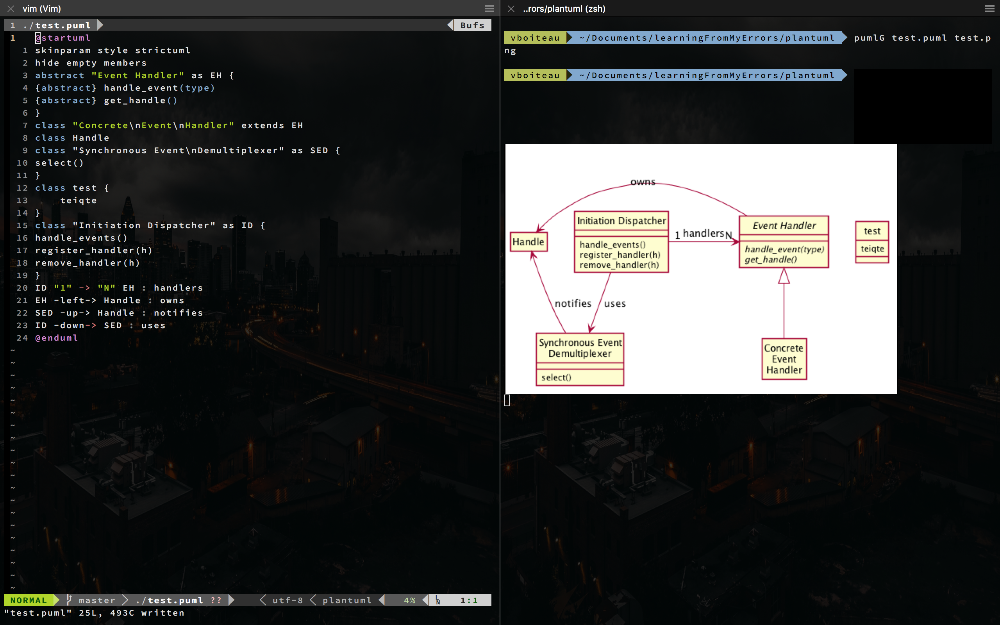

# Plant Uml Generation Set Up

Dependencies:

- [imgcat](https://github.com/eddieantonio/imgcat)
- node
  - [node-plantuml](https://www.npmjs.com/package/node-plantuml)
- [fswatch](https://github.com/emcrisostomo/fswatch)
- bash/zsh shell

## installation ##

- install node if not already
- install node-plantuml
```
npm install -g node-plantuml
```
- install fswatch
```
# tested on osx
brew install fswatch
```
- Copier le script [imgcat](https://raw.githubusercontent.com/gnachman/iTerm2/master/tests/imgcat) dans ton fichier des executable de ton user. In case of my Mac $HOME/bin/imgcat.

- Copier ce script sous le nom du script plant uml dans le dossier des executable in my case $HOME/bin/pumlG.
```bash
#!/bin/bash
input="$(pwd)/$1"
export PUML_G_OUTPUT="$(pwd)/$2"
fswatch -0 "$input" | xargs -0 -I{} puml generate "{}" -o "$PUML_G_OUTPUT" &
fswatch -0 "$PUML_G_OUTPUT" | xargs -0 -I{} imgcat "{}" &
```
- Add executable writes on imgcat and plantuml generator script
- refresh $PATH CTRL+ENTER in osx

## Usage ##

```
{script name} {Plantuml file} {png file}
#example
pumlG test.puml test.png
```



### kill ###
```
pkill fswatch
```


### snippets ###

If using UltiSnips in Vim, you can use snippets in plantuml.snippets.

